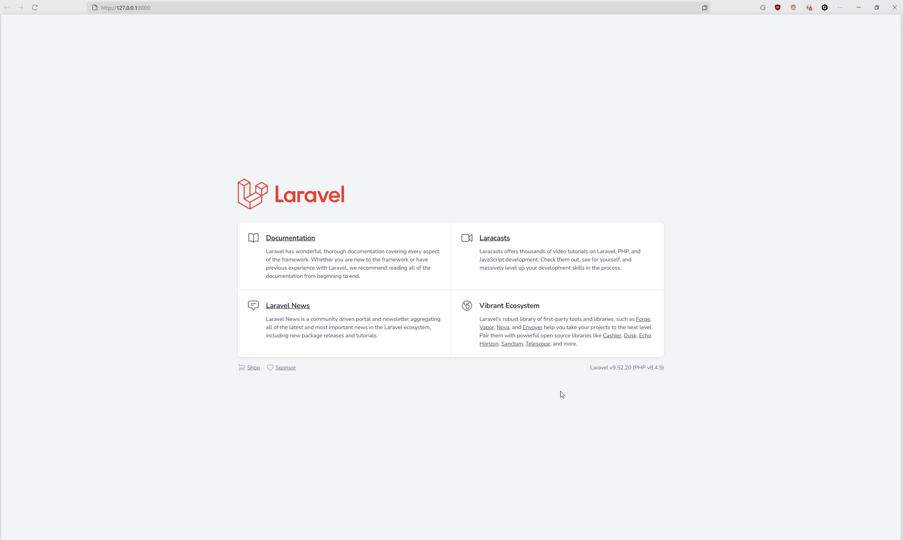

## 1. Laravel Setup
Follow these steps in order:
1. [Install PHP](https://www.youtube.com/watch?v=n04w2SzGr_U)  
   *(You can follow this video for a quick and clear guide.)*
2. [Install Composer](https://getcomposer.org/)  
   *Use the **default installation settings** and check if the preselected php path matches the path where you installed in the first step.*
3. [Install Node.js and npm](https://nodejs.org/en)  
4. Install Laravel globally by running:  
   ```bash
   composer global require laravel/installer
   ```
## 2. Database setup
### Install PostgreSQL
1. Download the newest [PostgreSQL](https://www.enterprisedb.com/downloads/postgres-postgresql-downloads) database version.
2. Run the installer and [follow these steps](https://www.w3schools.com/postgresql/postgresql_install.php).
3. Run `psql --version` command on your console. Should display current version: `psql (PostgreSQL) 17.4`.
4. (Optional) if the third step failed, you need to update your `PATH` variable:
    1. Find where your PostgreSQL binaries are, with default installation path should be: `C:\Program Files\PostgreSQL\17\bin`.
    2. Open "**Edit the system environment variables**" application.
    3. Click "**Environment variables...**".
    4. Under "**System variables**" (or "**User variables**", if you prefer), find and select "**Path**", then click "**Edit**".
    5. Click "**New**" and paste the path to the PostgreSQL `bin` folder.
    6. Save and exit.
    7. Run `psql --version` on console to verify the results.
    8. Might need to restart your PC if you are using Windows.
### Create the database
1. On your console run command `psql -U postgres`.
2. Enter password, if followed the installation guide like provided, the password should be `postgres`.
3. Run command ` CREATE DATABASE organai_plius;` (do not forget the semicolumn).
4. Running command `\l` should list your created database.
5. Connect to created database `\c organai_plius`.
6. You should be prompted with `You are now connected to database "organai_plius" as user "postgres".`.
### Install pgAdmin 4 (optional)
For GUI of the database use [pgAdmin](https://www.pgadmin.org/) (should be installed together with PostgreSQL). You can manage the database without ever needing the command line.
### Enable PostgreSQL PHP extentions
1. Go where you installed php (should be `C:\php-8.4.5`).
2. Open `php.ini` file.
3. Uncomment `;extension=pdo_pgsql` and `;extension=pgsql`.
4. Save changes.
## 3. Project setup
1. Install [Git](https://git-scm.com/downloads) if you haven't already.
3. Install [GitHub CLI](https://cli.github.com/) and connect to your GitHub account using command `gh auth login` (this will configure your locally installed Git).
2. Create directory of the project `organai-plius`.
4. Run Git Bash from newly created directory.
5. Clone the project's repository: 
    ```git
    git clone https://github.com/ManfredasLamsargis/OrganaiPlius.git
    ```
6. Run the project:
    ```cmd
    php artisan serve
    ```
7. Connect via provided link:
    